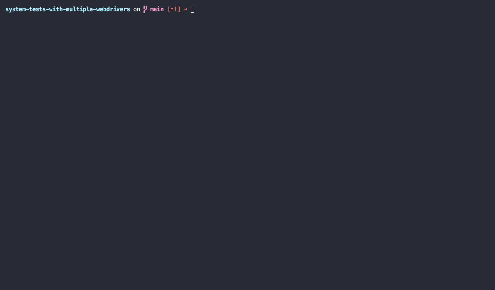

# Overview

This repository reproduces a minimal set of conditions that causes the Rails test runner to hang if there are multiple webdrivers configured. A high-level overview of the setup:

- cuprite + selenium
- Rails system tests
- Postgres

To start simple (i.e. before extracting a Module / Concern of some kind), I wrote two parent test classes:

- `ApplicationSystemTestCase` - the default test case in Rails `driven_by :cuprite`
- `SeleniumSystemTestCase < ApplicationSystemTestCase` - a subclass `driven_by :selenium_headless`

I made a `HomeController` with a simple 2-sentence `show` view. I then wrote two system tests that visit that home page - one using Cuprite and one using Selenium.

The tests run and pass, but then hang indefinitely until I kill the process:

I made a nearly-identical repository [here](https://github.com/shipstar/rspec-with-multiple-webdrivers) using RSpec to see if this is specifically an issue with the system test runner. `rails spec` passes without hanging in that repository.